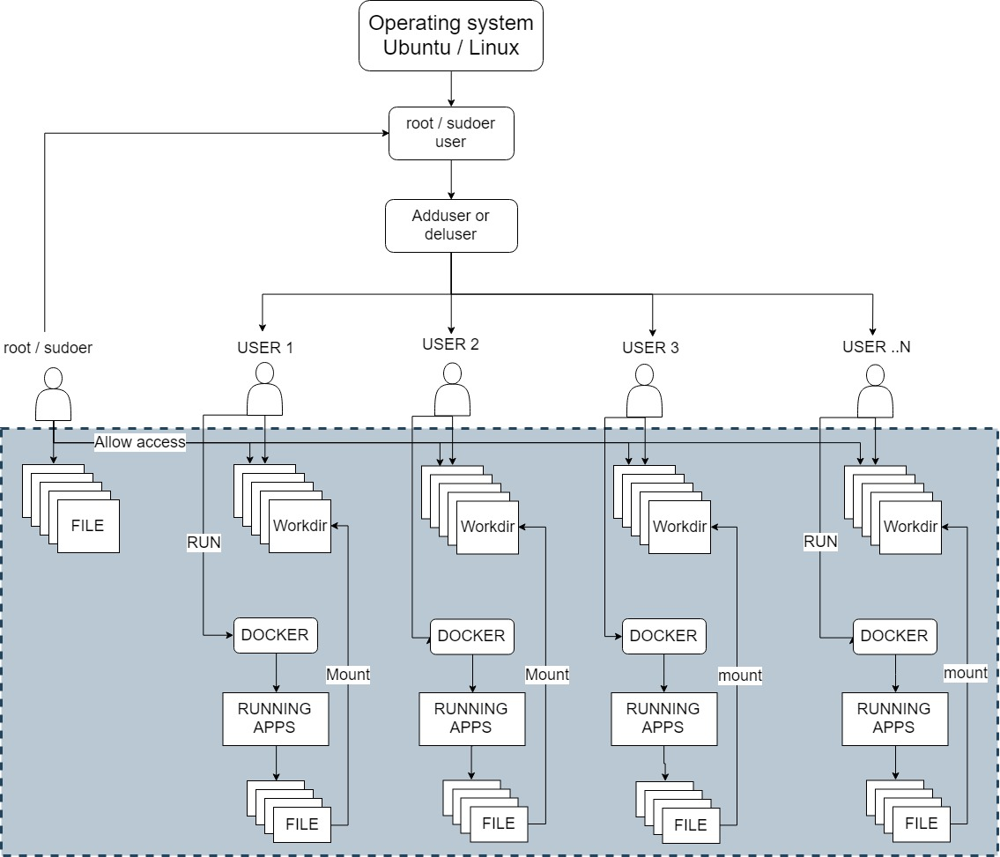
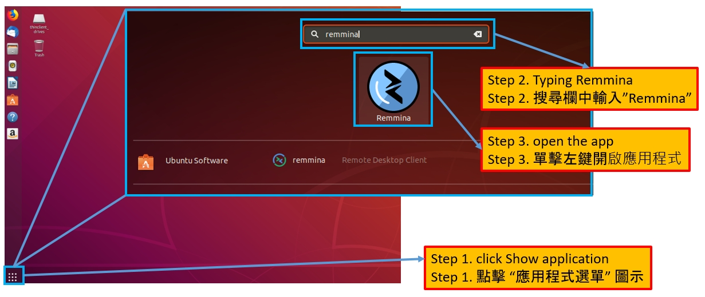
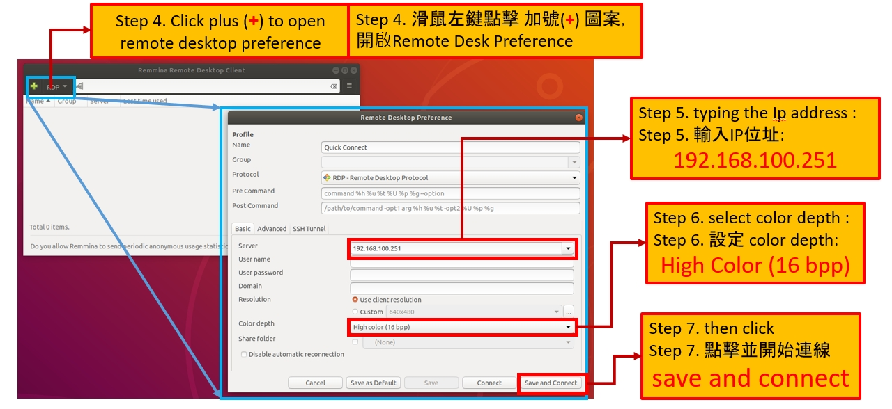
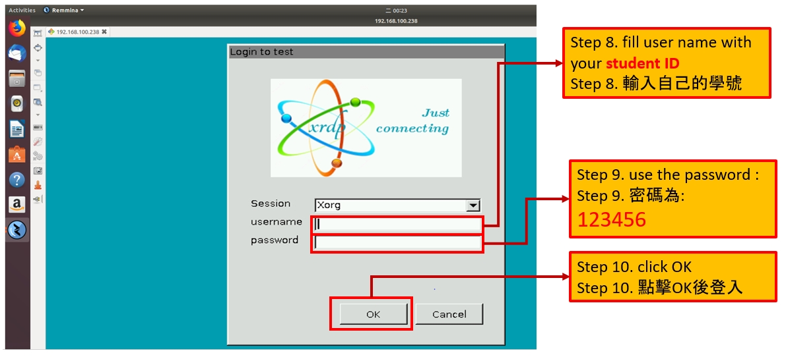
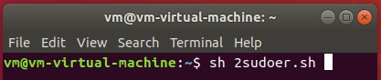
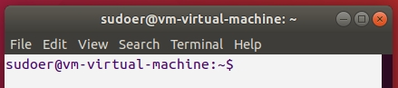

# Setting Environment for Classroom 

For manage classroom have many user we can use XRDP, Its mean student and teacher work in the same Operating System Machine with different user. student cat get in to the system with login in they are own user.

To setup the system following the steps.

### 1. Install Xrdp in Linux

1. [Install xrdp in Linux OS](https://www.azureunali.com/linux-ubuntu-18-04-xrdp-remote-desktop-config-problem/). in this situation, I already write the bash script to make easy. for execute the script typing command like bellow this.

   * **sh xrdp.sh**

2. Open X11 folder and edit Xwraper.config. following this command.

   * **vi /etc/X11/Xwraper.config**

     after that change the service config

     original: *allowed_users=console* 

     change to : *allowed_users=anybody*

3. create and copy file .xsessionrc to *skel* folder 

   * **cp .xsessionrc /etc/skel/**

4. solve the authentication required to create managed color device problem by create file authentication.  follow the command:

   * **vi /etc/polkit-1/localauthority/50-local.d/45-allow.colord.pkla**

   and copy this :

   *[Allow Colord all Users]*

   *Identity=unix-user:* *

   *Action=org.freedesktop.color-manager.create-device;org.freedesktop.color-manager.create-profile;org.freedesktop.color-manager.delete-device;org.freedesktop.color-manager.delete-profile;org.freedesktop.color-manager.modify-device;org.freedesktop.color-manager.modify-profile*

   *ResultAny=no*

   *ResultInactice=no*

   *ResultActive=yes*

   or you can copy file I already make:

   * **cp 45-allow.colord.pkla /etc/polkit-1/localauthority/50-local.d/**

### 2. Add user for student

come to root user and execute the script following the command :

* sh add_user.sh

If you want to change the name of student just edit the **user.txt** file.

### 3. File system 

This system we use bind mount to connect the host directory in to a container. in Linux we can set the mode of permission of directory. so even all of student work in the same machine but they are cant access the file each other. for more clearly understand about the file system you can see the picture bellow this.

Where the root/sudoer user have ability to add user,delete user and permission to read,write and execute all file from all user.

### 4. create container for user

After you add user, you also must create container for each user. you can execute the file of **run.sh** following the command:

- sh run.sh

to check the container you can use command :

- docker ps

### 5. Running container in the system 

1. Running the remmina apps in Linux for remote desktop

2. connect to server using ip address. 

3. login to server using own user. 1 user have 1 account. 

4. copy the script 2sudoer.sh to your home directory. and following the command for running container Ubuntu system with sudo permission
   - sh 2sudoer.sh

5. the container will running and where user will change from original user to be sudoer user like picture bellow this.

### 6.Delete student User

Delete user will complete when you in the root user, following the command :

- sh del_user.sh

#### Reference :

[1. www.azureunali.com](https://www.azureunali.com/linux-ubuntu-18-04-xrdp-remote-desktop-config-problem/)

[2. c-energy](http://c-nergy.be/blog/?p=13390)

